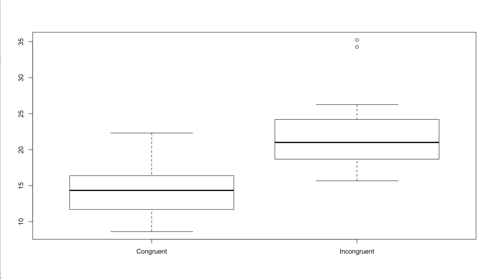
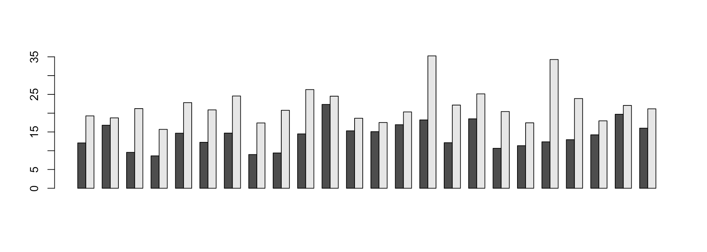

1. Independent variable: a congruent words condition / an incongruent words condition;
Dependent variable: the time it takes to name the ink colors in equally-sized lists.
 
2. Null hypothesis: The time it takes for the population to name the ink colors in equally-sized lists has no difference when it is a congruent words condition and when it is an incongruent words condition.
(μC=μI)

Alternative hypothesis: there is a difference in time it takes for the population to name the ink colors in equally-sized lists when it is a congruent words condition and when it is an incongruent words condition.
(μC=/= μI)
A dependent two-tailed t-test should be performed because first, the sample size is small (smaller than 30); second, the objects are the same group of people; third, we cannot tell which condition would take more time for sure before the test.
 
3. Descriptive statistics:
Central tendency: mean_congruent_=14.05; mean(incongruent)=22.01.
variability: standard deviation(congruent) =3.56; standard deviation(incongruent) = 4.80.
 
4. boxplot:
R-code:
 
library(ggplot2)
setwd("/Users/wenjia.ma/Downloads/")
dat = read.csv("/Users/wenjia.ma/Downloads/stroopdata.csv", header = TRUE)
view(dat)
boxplot(as.matrix(dat[,]), beside=T)

The time it takes in reading incongruent words (with a median of about 15) is generally more than the time in reading congruent words (with a median of about 22). The distribution of reading incongruent words is right skewed with two outliers.
 
R-code:
barplot(t(as.matrix(dat[,])), beside=T)

This is a bar chart of the times of reading congruent and incongruent words. As can be seen, the time of reading incongruent words is in grey and is higher than the time of reading congruent words, which is marked black.
 
5.
 
R-code:
dat<-dat %>%
  mutate(difference= Congruent-Incongruent)
 
std <- function(x) sd(x)/sqrt(length(x))
mean(dat$difference)/std(dat$difference)
qt(0.025,df=23)
 
two-tailed confidence level alpha=0.05;
degree of freedom=23;
T critical value= -2.068658;
 
Mean(difference): -7.964792
Standard Error(difference): 0.9930286
T -score: -7.964792/0.9930286= -8.020707
 
T-score falls outside the T critical value scope at 0.05 level, so we reject the Null hypothesis. It matches my expectation.
 
6. Many factors may lead to the effects observed. One is the activities in people’s brains are interfered by the color and the meaning of words. Second is that the same group of people gets tired in the second experience so they spent more time on the task.
One other similar task may be “to read numbers that are written in English but with a picture of the Arabic number attached to it”.
 
